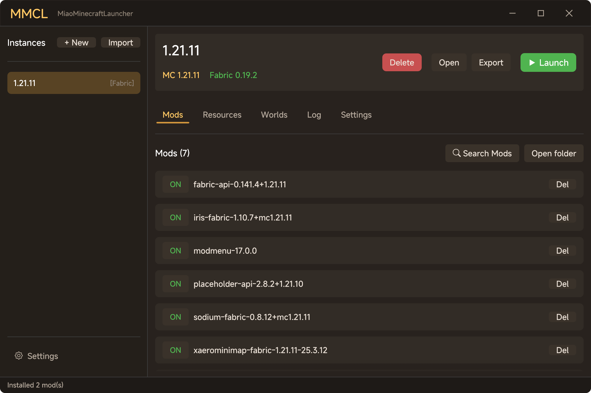
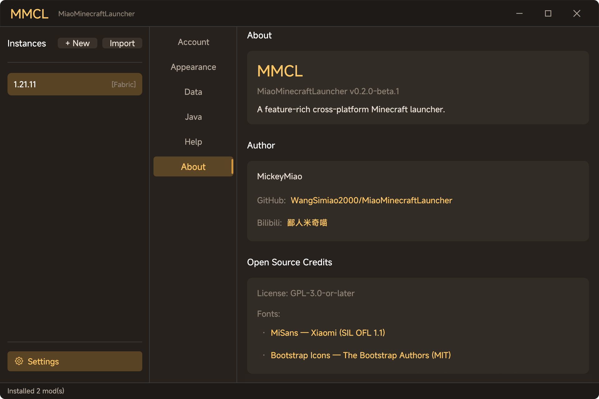

<div align="center">


# MMCL (MiaoMinecraftLauncher)

A feature-rich Minecraft launcher built in Rust — fast, native, and open source.

[](LICENSE)
[](rust-toolchain.toml)
[](#development)

</div>

---

## Screenshots

<p align="center">
  
  <br>
  <em>Instance detail — Fabric 1.21.11 with installed mods</em>
</p>

<p align="center">
  
  <br>
  <em>Settings — About</em>
</p>

## Features

| Category | Highlights |
|----------|-----------|
| **Instances** | Create, configure, and launch isolated Minecraft instances |
| **Mod Loaders** | One-click install for Fabric, Quilt, NeoForge, and Forge |
| **Modrinth** | Search & install mods with automatic dependency resolution |
| **CurseForge** | Search & install mods with built-in API key |
| **Modpacks** | Import/export `.mrpack` modpacks |
| **Java** | Auto-detect compatible JVM or download from Adoptium |
| **Downloads** | BMCLAPI mirror, multi-source failover, concurrent downloads |
| **Auth** | Microsoft OAuth device-code flow, offline mode, authlib-injector (LittleSkin, etc.) |
| **Diagnostics** | Crash-report & log parsing with mod-level identification |
| **Updates** | Self-update from GitHub Releases |
| **Resources** | Resource packs, shader packs, world saves |

## Quick Start

### Build from Source

Requires Rust nightly (pinned in `rust-toolchain.toml`).

```bash
git clone https://github.com/WangSimiao2000/MiaoMinecraftLauncher.git
cd MiaoMinecraftLauncher
cargo build --release
```

Binaries output to `target/release/`:

| Binary | Description |
|--------|-------------|
| `miao` | Command-line interface |
| `miao-gui` | Native GUI (egui) |

### System Dependencies (Linux GUI)

```bash
# Debian / Ubuntu
sudo apt install libgtk-3-dev libxcb-render0-dev libxcb-shape0-dev libxcb-xfixes0-dev
```

### Run

```bash
# GUI
cargo run -p miao-gui --release

# CLI examples
miao versions
miao new 1.21.1 --name "My Instance" --loader fabric
miao launch "My Instance"
miao mod-search sodium --mc-version 1.21.1 --loader fabric
miao mod-install "My Instance" sodium
```

## Architecture

```
crates/
├── core/    Core library — auth, downloads, instance, modloaders, Modrinth, CurseForge
├── cli/     CLI frontend (clap)
└── gui/     Native GUI frontend (egui / eframe)
```

See [`docs/architecture.md`](docs/architecture.md) for detailed module documentation.

## Tech Stack

| Component | Choice |
|-----------|--------|
| Language | Rust (nightly) |
| Async | tokio |
| HTTP | reqwest |
| GUI | egui 0.34 / eframe |
| CLI | clap (derive) |
| Serialization | serde + toml / json |
| Font | MiSans Medium (bundled) |
| Icons | Bootstrap Icons (bundled TTF) |

## Development

```bash
cargo check --workspace          # Compile check
cargo test --workspace           # Run all tests
cargo clippy --workspace -- -D warnings  # Lint
cargo fmt --all                  # Format
cargo tarpaulin -p miao-core --skip-clean  # Coverage
```

## Contributing

1. Fork the repository
2. Run `sh .githooks/install.sh` to enable pre-commit/pre-push hooks
3. Create a feature branch
4. Ensure `cargo clippy -- -D warnings` and `cargo test` pass
5. Submit a pull request

## Credits

| Asset | License | Source |
|-------|---------|--------|
| [MiSans](https://hyperos.mi.com/font/en) | SIL OFL 1.1 | Xiaomi |
| [Bootstrap Icons](https://icons.getbootstrap.com/) | MIT | The Bootstrap Authors |

## Author

**MickeyMiao** — [GitHub](https://github.com/WangSimiao2000) · [Bilibili](https://space.bilibili.com/36913332)

## License

[GPL-3.0-or-later](LICENSE)
